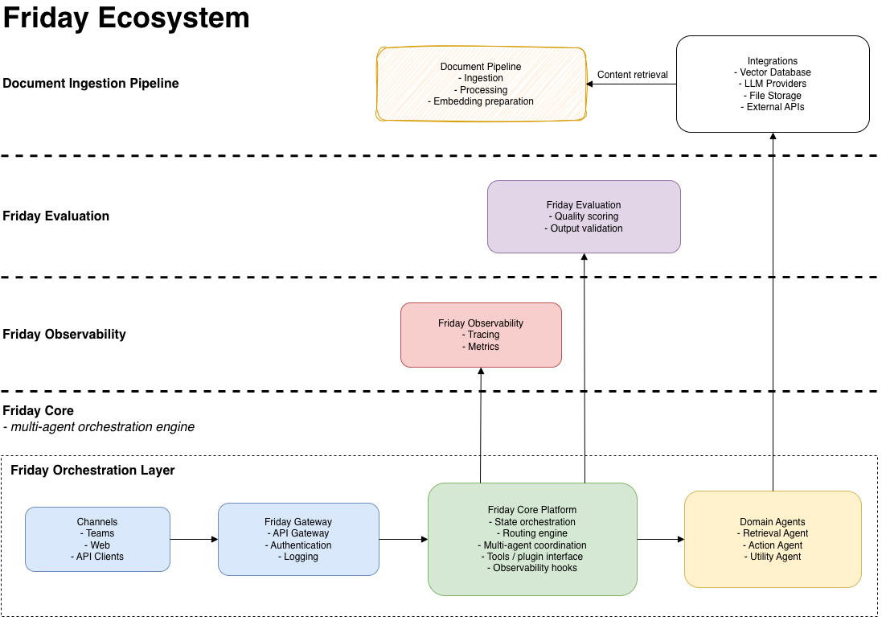

# 🌐 The AI Integrators

*Multi-agent AI Orchestration • Evaluation • Observability*

  
  
  
  

> **Note**  
> Friday is a personal open-source project built for learning and experimentation with multi-agent orchestration patterns.  
> It is not affiliated with any employer, customer, or commercial offering.

------------------------------------------------------------------------

## 🚀 What We Build

**Friday** is a modular ecosystem for constructing **enterprise-grade
multi-agent AI workflows**, inspired by:

-   Microsoft Agent Framework
-   LangGraph
-   OpenAI MCP
-   A2A routing
-   LangSmith / DeepEval
-   LangFuse-style observability

Friday focuses on:

-   determinism
-   auditability
-   evaluation-first design
-   enterprise observability
-   cloud / on-prem flexibility

------------------------------------------------------------------------

## 📘 Overview Diagram

The Friday Ecosystem consists of four coordinated layers:  
Document Pipeline → Evaluation → Observability → Core Orchestration Layer

  

------------------------------------------------------------------------

## 🧩 The Friday Ecosystem

### 🔹 friday-core

Core orchestration & agent runtime.
https://github.com/theaiintegrators/friday-core

### 🔹 friday-evaluation

Reusable evaluation & scoring engine.
https://github.com/theaiintegrators/friday-evaluation

### 🔹 friday-observability

Metrics, dashboards & insights.
https://github.com/theaiintegrators/friday-observability

------------------------------------------------------------------------

## 🏛 Architecture

               ┌───────────────────┐
               │   Observability   │
               └─────────▲─────────┘
                         │
            ┌────────────┴────────────┐
            │      Orchestrator       │
            └────────────▲────────────┘
                         │
                  ┌──────┴──────┐
                  │ Evaluation  │
                  └─────────────┘

------------------------------------------------------------------------

## 🧭 Roadmap

-   MCP tool integration
-   Parallel execution patterns
-   Workflow visualizer
-   LangFuse auto-enrichment
-   Built‑in safety evaluators
-   Friday CLI
-   Deployment templates

------------------------------------------------------------------------

## 🔭 Vision

Friday aims to make AI systems:

-   **Predictable**
-   **Testable**
-   **Observable**
-   **Enterprise-ready**

With a code-first, extensible design that scales from prototypes to full
production platforms.

------------------------------------------------------------------------

## 📄 License

MIT License
Copyright © 2025
The AI Integrators

------------------------------------------------------------------------

## 💬 Contact & Contributions

-   Open an Issue or Discussion
-   PRs welcome
-   https://github.com/theaiintegrators
